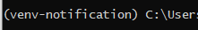
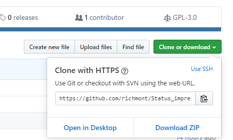
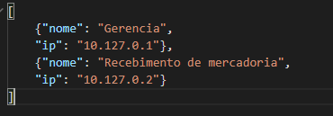
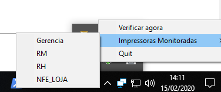

# Status_impressora_Lexmark

Script que utiliza da página de status de impressoras Lexmark MS811 para gerar notificações na área de trabalho.  
## Funcionamento  
O software lê a página de status da impressora através do IP informado na configuração, usando beautifulsoup4, colhe a informação das bandejas, quando uma bandeja está com papel, mostra "OK", com pouco ou nenhum papel, mostra "Sem papel" ou "Baixo". Tendo essa informação, varre as páginas de status de múltiplas impressoras e, quando detecta que uma delas está sem o status OK, mostra uma notificação Toast (integrada ao sistema) do Windows 10. Conta com um ícone de notificação (tray icon) que permite exibir quais impressoras estão monitoradas e um botão para escaneá-las na hora.  

## Motivação
Antecipar o problema da falta de papel nas impressoras da empresa que trabalho. Recebendo avisos no computador antes que seja preciso alguém enviando impressões ligue ao setor de informática avise que é necessário reabastecer. Além da motivação prática, gostaria de fornecer solução pra um problema diferente dos programas que fiz até então.

## Requisitos
* Windows 10
* Python 3.8>
## Requirements.txt
<code>
beautifulsoup4==4.8.2  
certifi==2019.11.28
chardet==3.0.4
idna==2.8
infi.systray==0.1.12
pypiwin32==223
pywin32==227
requests==2.22.0
soupsieve==1.9.5
urllib3==1.25.8
win10toast-persist==0.10.1
</code>

## Recursos a serem implementados:
* Verificação automática a cada intervalo de tempo
* Execução sem janela do console
* Empacotar em formato executável
* Exibir notificação em caso de erro de conexão

# Como usar?
Recomendo que use ambiente virtual (virtualenv)  
<code>
python -m pip install virtualenv

python -m virtualenv venv-notification
</code>  
Sendo "venv-notification" o nome do seu ambiente virtual. Entre na pasta recém criada  
<code>cd venv-notification</code>  
Execute o script para ativar o ambiente virtual  
Com Powershell  
<code>
Scripts/activate.ps1
</code>  
Ou CMD  
<code>
Scripts/activate.bat
</code>  
Certifique-se de que o virtualenv está ativo:  
  
Baixe o GIT pro seu sistema [neste local](https://git-scm.com/download/win) ou baixe o zip do repositório e descompacte dentro da pasta do ambiente virtual.  

Caso escolha pelo GIT, clone o repositório dentro do venv:  
<code>git clone https://github.com/richmont/Status_impressora_Lexmark</code>

Para baixar o zip:
  

Instale as dependências do python:  
<code> pip install -r requirements.txt</code>  

Tendo o software baixado e dependências instaladas, edite a configuração <code>config.json</code> seguindo o exemplo.

Execute para se certificar que tudo está funcionando  
<code>python main.py</code>  
Caso uma das impressoras esteja sem papel, receberá as notificações, depois surgirá um ícone da barra de notificação:  
  
Clicar em uma das impressoras, por enquanto, não tem efeito algum, clicar em verificar agora escaneia as bandejas de todas as impressoras e, caso estejam sem papel, exibirá notificação.  
Para manter o programa rodando sem ser diretamente pelo python, clique em <code>executar.bat</code>